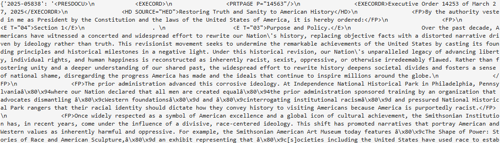
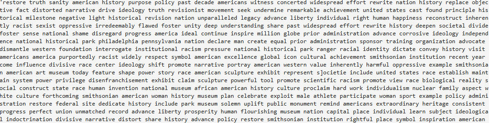
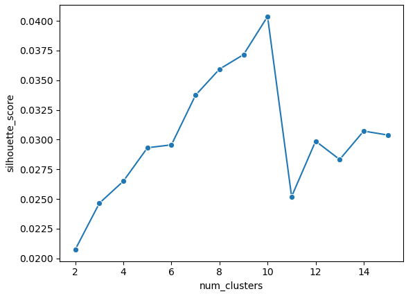
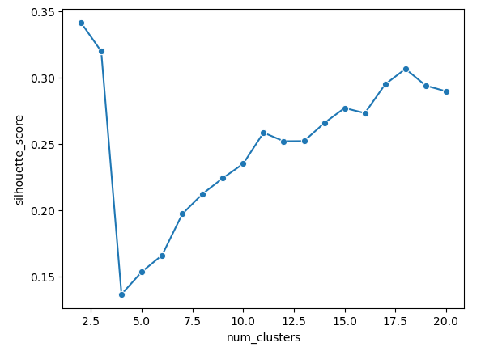
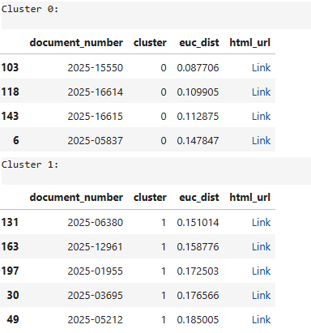
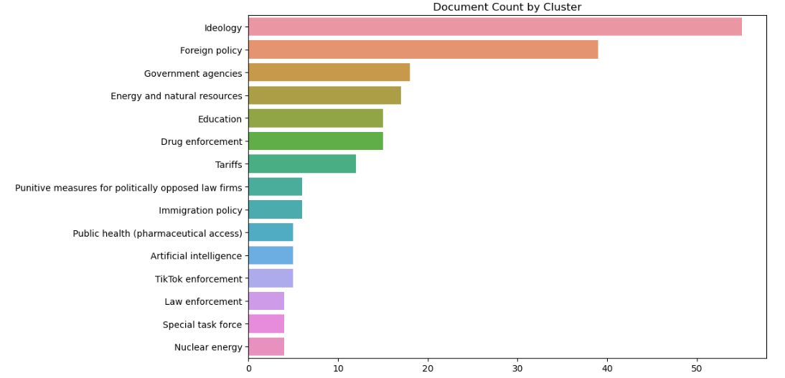
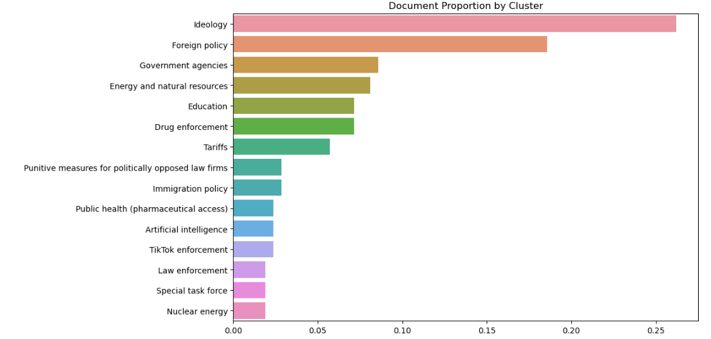

# Project Overview

Given the fast pace at which President Trump is announcing executive actions in his second term, it is not practical for a human to manually parse through a large corpus of documents to determine which public policy areas are being impacted. Therefore, a combination of latent semantic analysis and K-means clustering algorithms were used to group executive actions by policy themes based on content similarity. The output of this project allows the user to quickly see the distribution of policy themes in the executive actions and inspect a sample set of documents before deciding to dive deeper into specific areas.

The project was organized using the following workflow:

1. Provide a brief introduction of the theory behind the K-means clustering algorithm to explain how it works
2. Walk through a simplified implementation of the K-means clustering algorithm using Python object-oriented programming (OOP) to demonstrate how machine learning libraries like scikit-learn work under the hood
3. Collect metadata and data related to the executive actions from the Federal Register website and API
4. Preprocess text
5. Convert corpus into a TF-IDF matrix to represent text quantiatively
6. Implement latent semantic analysis to reduce data dimensionality and discover policy themes
7. Train and evaluate the K-means clustering model
8. Assign policy themes to clusters and compute the distribution of policy themes in the executive actions

# Theory and OOP Implementation

Refer to sections "The theory behind K-means clustering" and "Implementation via object-oriented programming" in the project Jupyter notebook for details.

[Link to project Jupyter notebook (raw)](https://github.com/0-5stepdown/Trump_Executive_Actions/tree/main/code)

[Link to project Jupyter notebook (nbviewer)](https://nbviewer.org/github/0-5stepdown/Trump_Executive_Actions/blob/ac50f8ab1a8ecfea2698bd2202340b8c85bf80cc/code/K-means%20clustering.ipynb)

# Metadata and Data Collection

The metadata and data related to the executive actions were collected in two steps:

1. Retrieve the Federal Register document number of each executive action from a CSV file hosted on the Federal Register website
2. Using the Federal Register API, request a XML version of each full text by referencing the Federal Register document number

Anyone interested in inspecting the data sources more closely can access the Federal Register website and API documentation at the links below:

[Link to Federal Register website](https://www.federalregister.gov/presidential-documents/executive-orders/donald-trump/2025)

[Link to Federal Register API documentation](https://www.federalregister.gov/reader-aids/developer-resources)

Note that the CSV file consistently has an empty space preceding the Federal Register document number. These were stripped out to make sure that the subsequent API requests work properly. 

To retrieve the corpus of executive action documents, JSON metadata for each document were first obtained through API requests. Then, the JSON key containing the URL to the XML document was referenced to obtain the full text. Both were cached to avoid making repeated API requests.

# Preprocess Text

After inspecting a few samples of the XML documents, the following text preprocessing steps were implemented across the entire corpus:

1. Remove broken UTF encoding
2. Remove XML markup tags
3. Remove boilerplate language (e.g., "By the authority vested in me...")
4. Turn into lowercase
5. Remove unnecessary whitespace
6. Tokenize full texts into lists of words
7. Remove stopwords (e.g., "and", "the", "of", etc.), punctuations, and numbers from tokens
8. Lemmatize (i.e., convert words to their root/base form (e.g., "better" converted to "good") tokens

Here is an example of XML text before preprocessing:

And here is an example of fully processed and tokenized text:

The clean and tokenized corpus was cached to avoid having to run the text preprocessing function repeatedly.

# Model Performance with TF-IDF Matrix vs. Latent Semantic Analysis

The TF-IDF matrix generated from the corpus indicated that there were a total of 210 executive actions containing 6,329 unique words as of October 20, 2025. For initial experimentation, silhouette scores were calculated on K-means clustering models with the number of clusters ranging from 2 to 15 (15 was set as the ceiling to approximate the number of congressional committees that specialize in policy areas). Due to the high dimensionality of the data, the models all resulted in poor silhouette scores, which indicated that the K-means clustering algorithm was having difficulty differentiating the content in the executive action documents. 

Therefore, latent semantic analysis (LSA) was used to reduce the dimensionality of the data and see if documents can be grouped into 15 policy themes. There were notable improvements to the silhouette scores when the K-means clustering models were run again with LSA's document-topic matrix instead of the TF-IDF matrix. 

# Results

After assigning each executive action document to one of 15 clusters, sample documents located closest to each cluster center were selected for human inspection. See below a screenshot of example document clusters:

The diagrams below describe the 15 policy themes that were identified by the model, as well as the distribution of executive action documents across the 15 policy themes.

